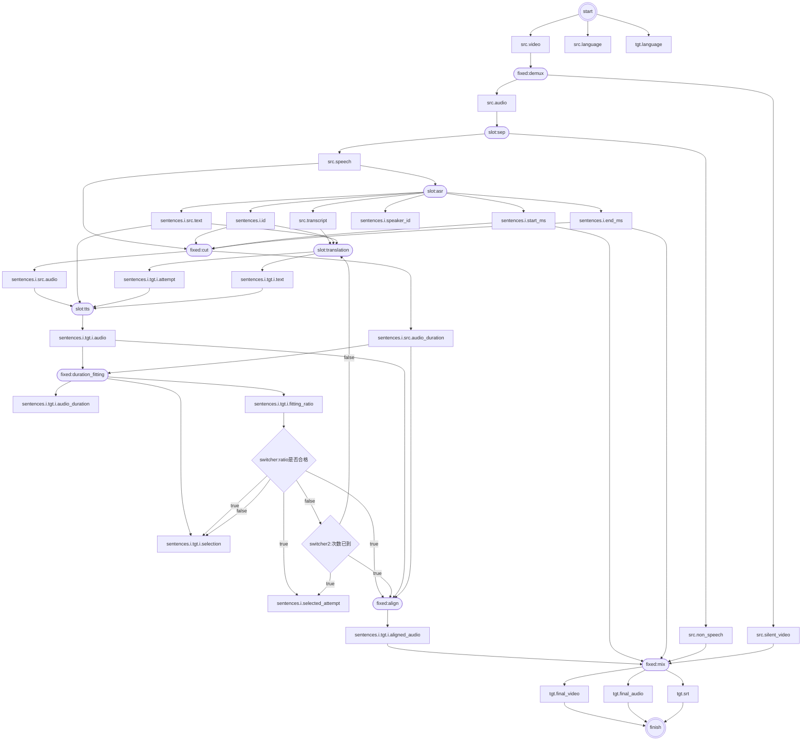

# MagicDub 全流程产物图（Draft）

> 方格 `[]` = 产物；圆角框 `([])` = 环节；双圆 `((()))` = 起止；菱形 `{}` = 分支。  
> 产物节点名与 [状态文件 assets 字段设计](2026-09-21_magicdub-cli状态文件assets字段设计.md) 对齐。  
> `sentences.i.src.audio_duration` 由 cut 按 `end_ms - start_ms` 计算写入，不是文件探测时长。  
> 状态：草稿，作为 `magicdub-cli` 流程底稿。不含下载上游、模型候选分叉与编排态字段。

## 产物图

## 环节与产物对照

与上方 Mermaid 一致；路径名为 assets 字段路径。

| 环节 | 类型 | 主要输入 | 主要输出 |
| --- | --- | --- | --- |
| start | 起止 | （任务入口） | `src.video`、`src.language`、`tgt.language` |
| demux | fixed | `src.video` | `src.audio`、`src.silent_video` |
| sep | slot | `src.audio` | `src.speech`、`src.non_speech` |
| asr | slot | `src.speech` | `src.transcript`；`sentences.i` 的 `id`／`start_ms`／`end_ms`／`speaker_id`／`src.text` |
| cut | fixed | `src.speech`、`sentences.i.id`／`start_ms`／`end_ms` | `sentences.i.src.audio`、`sentences.i.src.audio_duration`（= `end_ms - start_ms`） |
| translation | slot | `src.transcript`、`sentences.i.id`／`src.text` | `sentences.i.tgt.i.attempt`、`sentences.i.tgt.i.text` |
| tts | slot | `sentences.i.src.audio`／`src.text`、`tgt.i.attempt`／`text` | `sentences.i.tgt.i.audio` |
| duration_fitting | fixed | `tgt.i.audio`、`src.audio_duration` | `tgt.i.audio_duration`、`fitting_ratio`、`selection` |
| switcher（ratio 是否合格） | 分支 | `fitting_ratio` | 合格 → 写 `selection`／`selected_attempt` 并进 align；不合格 → 见下行 |
| switcher2（次数已到） | 分支 | 不合格结果 | 未到 → 回 `translation`（再 tts，attempt≥2）；已到 → 写 `selected_attempt` 并进 align（forced） |
| align | fixed | 采用的 `tgt.i.audio`、`src.audio_duration`、`selected_attempt` | `sentences.i.tgt.i.aligned_audio` |
| mix | fixed | 各句 `aligned_audio`／`text`／时间窗、`src.non_speech`、`src.silent_video` | `tgt.final_video`、`tgt.final_audio`、`tgt.srt` |
| finish | 起止 | 上述三个最终产物 | （任务结束） |

说明：

- 所需采样率／封装由各 slot adapter 自行转换，图中无统一「ASR 专用副本」步骤。
- `mix` 本版一并产出成片、混音音频与 SRT（无独立 subtitle 环节）。
- 费用汇总在 assets.`cost`，本图未展开。

## 刻意未画入的内容

- YouTube／素材下载（`magicdub-download` 上游）
- 模型候选分叉（Whisper／Fun-ASR／Qwen、Demucs／MVSep、IndexTTS／Fish 等）
- 项目恢复、断点续跑、人工审校页
- 口型修正（明确不做）

