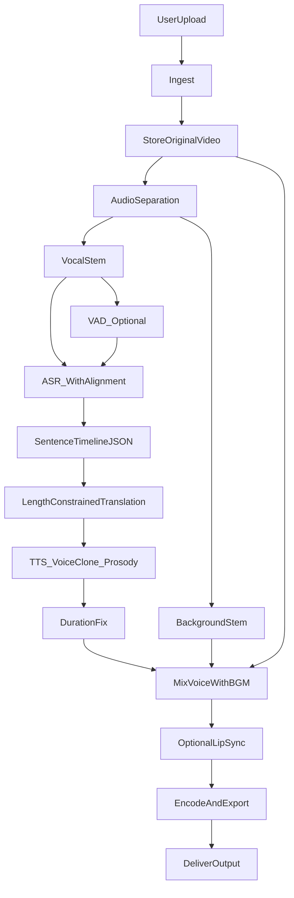

## MagicDub 技术框架（Releases｜可落地蓝图）

> 这份文档的目标是：读完就能开始实现一个 Web 编排服务（哪怕先用占位 API），并且每个环节都可替换、可回滚、可观测。

---

## 1. 系统边界（Web App）

### 1.1 组件划分

- **前端（Web）**
  - 上传视频、选择语言与参数（是否唇形、强度档位）
  - 展示任务状态、预览、下载
- **后端（编排服务 Orchestrator）**
  - 任务创建与队列
  - 素材存储与权限（对象存储）
  - 调用外部 AI API（ASR / 翻译 / TTS / 可选唇形）
  - 最终合成与导出
  - 质量记录与可观测（日志、指标、链路）
- **对象存储（必选）**
  - 保存：原视频、分离音轨、人声片段、时间轴 JSON、最终视频

### 1.2 设计原则

- **接口先行**：每一步都以“输入/输出契约（URL + JSON）”定义，不把业务绑死在某个模型或供应商上。
- **可回滚**：某个环节失败时可降级（例如：不做唇形、不做声场、仅做音频替换）。
- **幂等与可重试**：同一任务重复提交不会产出混乱重复品；外部 API 超时可安全重试。

---

## 2. 主链路（Master Pipeline）

> 默认先做“低配但高体验”：优先保证 **时间轴对齐 + BGM 连续 + 语速匹配**；唇形后置。

### 2.1 数据流（概览）

---

## 3. 模块分层与职责（可替换设计）

### 3.1 音频预处理层

**目标**：得到“干净可识别的人声”和“可复用的背景音”，并为后续对齐创造条件。

- **人声/BGM 分离（必选）**
  - 输入：原视频音轨
  - 输出：`vocal_stem.wav`（干声）+ `bgm_stem.wav`（背景）
  - 关键点：BGM 必须连续保留，否则最终成品会“真空感”严重
- **VAD（建议）**
  - 输入：`vocal_stem.wav`
  - 输出：语音片段列表（起止时间），用于更稳的切句
- **响度/峰值管理（建议）**
  - 输入：生成的人声片段（多段）
  - 输出：响度一致的人声（减少“忽大忽小”）

### 3.2 ASR 与对齐层

**目标**：得到可用于切句与对齐的时间轴（至少句子级，最好词级可用）。

- **ASR + 强制对齐（必选）**
  - 输出建议包含两层：词级时间戳 + 句子级聚合
- **说话人分离（可选）**
  - 对话类内容需要：把不同人说的话分开走不同音色/不同策略

### 3.3 长度约束翻译层（核心）

**目标**：让翻译结果在“可朗读时长”上接近原句窗口。

- 推荐采用 **迭代式翻译**：
  - 第一次翻译 → 估算朗读时长（可用经验规则或 TTS 预推理）→ 超长则压缩/改写 → 直至进入阈值
- 产物要保留“版本链”：
  - 原文、直译、长度约束译文、最终采用版本（便于回溯）

### 3.4 语音生成层（TTS / S2S）

**目标**：生成“像本人、节奏像、情绪像”的目标语言语音。

- **音色克隆（必选）**
- **韵律/情绪迁移（建议）**
  - 更先进路线是 S2S（Speech-to-Speech）：用原音频作为参考流，保留喘气/停顿/能量分布
- **语速/时长可控（必选）**
  - 需要能调 `speed/length_scale` 或具备可控时长策略

### 3.5 时长校正层（对齐兜底）

**目标**：把每句语音稳定塞回原时间窗口。

典型策略（按推荐顺序）：

- **句尾补静音**（生成短了）
- **轻微变速**（生成长了，控制在小幅度内避免失真）
- **必要时回到翻译层再压缩**（优先“文本变短”，再做音频微调）

### 3.6 视觉层（可选）

**目标**：让嘴型更贴合目标语言，但避免恐怖谷。

- **唇形同步**
  - 建议“强度可调”，默认弱一些以保留原表情动态
- **遮罩与边缘羽化**
  - 只重绘嘴部区域，边缘处理避免贴皮感
- **画面修复/增强**
  - 唇形后清晰度下降时做兜底修复

### 3.7 合成层（FFmpeg 为核心）

**目标**：把“生成的人声 + 原 BGM/环境声 + 原视频（或唇形后视频）”稳定合成为成品。

关键能力点：

- **混音**：人声与背景音的平衡；必要时做 ducking（人声出现时背景自动压低）
- **对齐**：按时间轴对每句人声做 `delay/offset`
- **编码**：统一输出规格（便于分发与回放兼容）

---

## 4. 核心接口契约（建议最先定）

> 先定 JSON 规范，后面的供应商/模型都能换。

### 4.1 句子级时间轴 `SentenceTimelineJSON`

建议最少字段：

- `sentence_id`
- `start_ms` / `end_ms`
- `speaker_id`（可选）
- `src_text`
- `src_lang`
- `tgt_lang`
- `tgt_text_raw`（直译）
- `tgt_text_constrained`（长度约束后）
- `voice_style`（可选：情绪/强度档）
- `audio_url`（生成片段地址）

### 4.2 任务状态机（后端必须有）

最少状态：

- `queued` → `processing` → `ready` / `failed`
- 子状态（便于观测与重试）：`separate` / `asr` / `translate` / `tts` / `mix` / `lip` / `encode`

---

## 5. 云端 API 选型与替代（文字要点）

> 目标：**国内可用优先**，缺口用国际平台补位。这里不把任何一家写死为唯一方案。

### 5.1 国内优先（常作为主干能力）

- **ASR/时间戳**：优先选择国内可用的高精度 ASR（尤其中文/中英混读与时间戳能力强）
- **翻译/LLM**：支持“长度约束迭代提示”的模型接口（性价比与稳定性要考虑）
- **TTS/音色克隆**：优先选择提供成熟 API、支持语速/风格控制的服务
- **对象存储**：用于所有中间产物落地（避免供应商间传输瓶颈）

### 5.2 国际补位（补齐开源模型的托管推理）

- **对齐增强 ASR（如 WhisperX 类）**：当你需要更强的强制对齐能力时作为补位
- **人声分离（UVR5 类）**：当国内能力不足或效果不稳定时补位
- **唇形同步（LivePortrait 类）**：当国内没有稳定可用 API 时补位

### 5.3 替换策略（务必写进代码结构）

- 每个模块只依赖“接口契约”，不依赖供应商 SDK 的细节
- 把供应商适配写成独立适配器：
  - `AsrProvider`
  - `TranslateProvider`
  - `TtsProvider`
  - `LipSyncProvider`
  - `SeparationProvider`

---

## 6. 非功能需求（工程化底座）

- **成本控制**
  - 以“每分钟视频成本”作为定价与优化的核心指标
  - 支持跳过可选步骤（例如不做唇形）
- **性能与时延**
  - 长任务必须异步：队列 + 回调/轮询
  - 大文件传输尽量走对象存储直传（前端直传、服务端拿 URL）
- **可靠性**
  - 外部 API 必须：超时、重试、退避、熔断
  - 每个步骤产物落地（可断点续跑）
- **幂等**
  - 以 `task_id` + `input_hash` 控制重复提交
- **可观测**
  - 每一步写入：耗时、成本估算、产物 URL、关键参数（脱敏）
- **安全与合规**
  - 任务留痕、访问控制、内容策略、可追溯审计

---

## 7. 落地建议（最短路径）

### 7.1 默认策略：低配但高体验

- 先把 **翻译可懂度、语速匹配、BGM 连续性、时间轴对齐** 做到“稳定好用”
- 唇形先不做，或者作为“高级开关”，并默认弱强度

### 7.2 第一版 Demo 的工程取舍

- 只支持：单人演讲 + 单一目标语言
- 先做句子级对齐（不要一开始就追求音素级完美）
- 用固定基准样本做回归（每次改动都能对比提升/退化）

