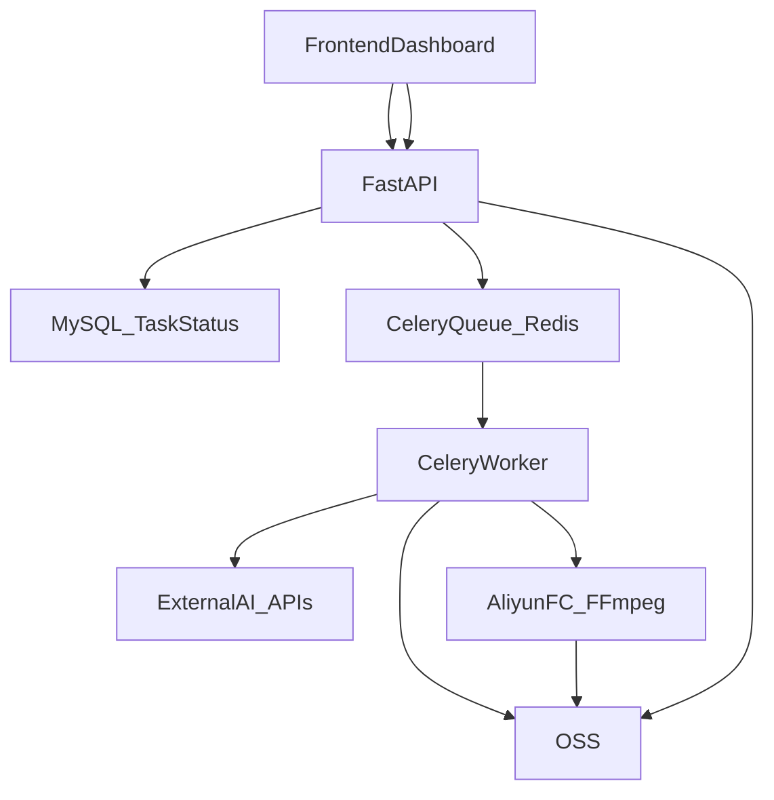

## MagicDub 开发文档（V1｜可落地实现说明）

> 目标：这份文档写给“实现者自己/AI”。读完后可以直接开始写代码与部署。  
> 约束：**异步 dashboard**、**前端不直连 MySQL**、**FFmpeg 合成在阿里云函数计算 FC**、本项目 **永远不做唇形/口型修正**。

---

## 1. 目标与非目标

### 1.1 V1 目标

- 支持 **英→中**（看外国视频）与 **中→英**（短视频出海）。
- 生成“译制片式”成品：**人声换语言**，且做到：
  - **时间轴对齐**（句子级，不抢拍不拖拍）
  - **BGM/环境声连续**（先分离再混回）
  - **听感自然**（音色/情绪尽量贴近原说话者）

### 1.2 明确非目标（永远不做）

- **唇形/口型修正**（无论任何版本都不做）

---

## 2. 系统架构（总览）

### 2.1 组件

- **前端（dashboard）**
  - 提交任务（视频 URL + 源语种 + 目标语种）
  - 轮询后端查看任务状态/进度/结果
- **后端 API（FastAPI）**
  - 参数校验、创建任务、写入状态、返回 `task_id`
  - 查询任务状态与结果
- **任务队列**
  - `celery + redis`
- **任务状态数据库**
  - `MySQL`（仅后端与 worker 访问，**不对前端直连**）
- **对象存储**
  - `Alibaba Cloud OSS`：中间产物与最终视频的唯一落盘位置
- **合成服务**
  - `Alibaba Cloud Function Compute (FC)`：运行 FFmpeg 合成与压制（输入输出全部 OSS URL）

### 2.2 数据流（概览）

---

## 3. API 设计（FastAPI）

> 说明：以下是“接口契约”，不是实现代码。实现时可按需要扩展字段，但不建议删减。

### 3.1 创建任务（提交）

- **方法**：`POST /v1/jobs`
- **请求体**
  - `source_video_url`: string（必填）
  - `source_lang`: string（必填，例如 `en`/`zh`）
  - `target_lang`: string（必填）
- **响应**
  - `job_id`: string
  - `status`: `queued`
  - `created_at`: ISO8601

### 3.2 查询任务（dashboard 轮询）

- **方法**：`GET /v1/jobs/{job_id}`
- **响应（建议字段）**
  - `job_id`
  - `status`: `queued | processing | ready | failed`
  - `stage`: `separate | asr | translate | tts | assemble | encode`（可空）
  - `progress`: number（0~1，可空）
  - `error_code` / `error_message`（失败时）
  - `result_video_url`（完成时）
  - `artifacts`（可选）：timeline JSON、音轨等 OSS URL

### 3.3 （可选）取消任务

- **方法**：`POST /v1/jobs/{job_id}/cancel`
- **说明**：V1 可先不做真正的“中断外部 API”，但至少要支持把任务标记为 `cancelled` 并阻止后续步骤执行。

---

## 4. 任务状态机与 MySQL 设计

### 4.1 状态机

- **主状态**
  - `queued`：已入队等待处理
  - `processing`：worker 正在处理
  - `ready`：成功产出 `result_video_url`
  - `failed`：失败并写入错误信息
- **阶段（stage）**
  - `separate`：音频分离
  - `asr`：ASR 与时间戳
  - `translate`：长度约束翻译
  - `tts`：TTS 生成
  - `assemble`：合成素材准备（音频对齐/拉伸）
  - `encode`：最终压制导出

### 4.2 表结构（建议）

最少字段建议：

- `job_id`（主键）
- `status` / `stage` / `progress`
- `source_video_url` / `source_lang` / `target_lang`
- `created_at` / `updated_at`
- `result_video_url`
- `error_code` / `error_message`
- `cost_estimate`（可选，阶段性累计）

> 重要：前端不直连 MySQL。前端只调用 `GET /v1/jobs/{job_id}`，由后端读取 MySQL 并返回。

---

## 5. worker 管线（核心实现）

> 本节按你草稿中的函数拆分组织，并补齐每一步的输入输出与落盘规则。  
> 推荐把每一步产物都写入 OSS，保证“可断点续跑”。

### 5.1 关键数据结构：`sentences[]`

`sentences` 是一个有序列表，按时间轴从早到晚排列。每条句子建议包含：

- `sentence_id`
- `sentence_start_time_ms` / `sentence_end_time_ms`
- `sentence_duration_ms`
- `sentence_source_audio_url`（可选：句子干声片段）
- `sentence_source_text`
- `sentence_target_text`
- `sentence_target_audio_url`
- `meta`（建议）
  - `asr_confidence`
  - `tts_duration_ms`
  - `stretch_ratio`
  - `provider_ids`（外部 API 的 request_id/model_id）

### 5.2 函数列表（逐步）

1. `fetch_video(source_video_url) -> source_video_path_or_url`
   - **做什么**：获取源视频（建议直接写 OSS：`raw/{job_id}/source.mp4`）。
2. `fetch_audio(source_video) -> source_audio`
   - **做什么**：从视频抽取音轨，写 OSS：`raw/{job_id}/source.wav`。
3. `separate_audio(source_audio) -> speech_audio, noise_audio`
   - **做什么**：把音轨分离为干声与背景（BGM/环境声）。
   - **落盘**：
     - `stems/{job_id}/speech.wav`
     - `stems/{job_id}/noise.wav`
4. `asr(speech_audio) -> timeline`
   - **做什么**：调用外部 ASR API，得到按句断开的文本与 `start/end`（ms）。
   - **落盘**：`timeline/{job_id}/asr.json`
5. 构建 `sentences[]`
   - **做什么**：把 ASR 的句子结果规范化为 `sentences` 结构（填 `start/end/duration/source_text` 等）。
6. `cut_speech(speech_audio, timeline) -> sentence_source_audio[]`（可选，但推荐）
   - **做什么**：按句子起止切割干声；句子之间空白丢弃；每段做轻微 fade in/out 避免爆音。
   - **落盘**：`segments/{job_id}/{sentence_id}.wav`
7. `translate_sentences(sentences, full_context) -> sentences`
   - **做什么**：调用外部 LLM 逐句翻译。
     - Prompt 必须包含：原句时长窗口（ms）、以及“要在窗口内读完”的硬约束
     - 建议传入全文上下文（ASR 全文）用于一致性与术语统一
   - **落盘**：`timeline/{job_id}/translate.json`
8. `tts(sentence_source_audio, sentence_target_text) -> sentence_target_audio`
   - **做什么**：调用外部 TTS（index-tts-2），用 `sentence_source_audio` 做音色/情绪参考，生成目标语言音频。
   - **落盘**：`tts/{job_id}/{sentence_id}.wav`
9. `refine_target_audio(sentences) -> sentences`
   - **做什么**：把每个 `sentence_target_audio` 的时长对齐到 `sentence_duration_ms`。
   - **规则（来自草稿，建议作为默认）**
     - 若 \(0.85 \le \frac{tts\_duration}{target\_duration} \le 1.15\)：用 FFmpeg 轻微拉伸/压缩到等长
     - 否则：回到翻译层重新改写（更短/更长）→ 再 TTS → 再对齐，直到满足
   - **落盘**
     - `tts/{job_id}/{sentence_id}.aligned.wav`
     - 记录 `stretch_ratio` 与重试次数到 `timeline/{job_id}/sentences.final.json`
10. `assemble_target_video(source_video, noise_audio, aligned_sentence_audios, timeline) -> target_video`
   - **做什么**：把 source_video 静音后，混入 `noise_audio`（保持连续），再把每句 `aligned_sentence_audio` 按 `sentence_start_time_ms` 放置。
   - **执行位置**：阿里云 FC（FFmpeg）。
   - **输出落盘**：`output/{job_id}/result.mp4`

---

## 6. 合成（FFmpeg in 阿里云 FC）

### 6.1 输入输出契约（建议）

- **输入（JSON）**
  - `source_video_url`（OSS）
  - `noise_audio_url`（OSS）
  - `sentences_tts_urls[]`（OSS，已对齐时长的句子音频）
  - `timeline_url`（OSS，包含 start_ms 与 sentence_id 的映射）
- **输出**
  - `result_video_url`（写回 OSS）

### 6.2 必备 FFmpeg 能力

- 混音：`amix`
- 句子级对齐：`adelay` 或等价 delay/offset 手段
- 响度统一：`loudnorm`（建议在最终混音前做）
- 小幅变速：`atempo`（必要时，尽量只在 `refine_target_audio` 阶段使用）
- 编码输出：统一编码参数，保证播放兼容与体积

---

## 7. 外部 API（来自草稿）

> 注意：这些是当前草稿里的选型记录。Releases 文档不承诺供应商长期不变，但开发实现需要先选一套跑通。

- **音频分离**：Fal.ai `sam-audio separate`
  - `https://fal.ai/models/fal-ai/sam-audio/separate`
- **ASR**：Fal.ai `wizper`
  - `https://fal.ai/models/fal-ai/wizper`
- **TTS**：Fal.ai `index-tts-2`
  - `https://fal.ai/models/fal-ai/index-tts-2/text-to-speech`
- **LLM**：OpenRouter `Gemini 3.1 Pro`
  - `https://openrouter.ai/google/gemini-3.1-pro-preview`

---

## 8. 本地开发环境（来自草稿）

- macOS（Macbook Air M2）
- `zsh 5.9`
- Python：草稿写 `3.11.11`（建议与生产镜像一致）
- venv：`venv`
- FFmpeg：`8.0`
- 说明：本地可把所有输入输出落到本地磁盘，但生产必须以 OSS 为准。

---

## 9. 生产部署（阿里云国际 ECS + Docker Compose）

### 9.1 机器与系统

- ECS：2 vCPU / 4GiB / 40GiB（草稿配置）
- 系统：Alibaba Linux（兼容 Ubuntu 24）

### 9.2 容器划分（建议）

- `api`：FastAPI
- `worker`：Celery worker（可横向扩容）
- `redis`：broker
- `mysql`：任务状态库

### 9.3 关键配置要点

- **环境变量与密钥**：API keys、DB 密码、OSS/FC 凭证只放 `.env`，不入库。
- **网络**：MySQL 不对公网；只允许 api/worker 内网访问。
- **幂等**：以 `job_id` 为主线，所有产物落盘路径都使用 `job_id` 前缀。
- **重试策略**：外部 API 超时/限流要可重试；参数错误不可重试。

---

## 10. 运维与质量（V1 也必须做）

- **日志**：每步记录耗时、外部 API 返回码、重试次数、产物 OSS URL（脱敏）。
- **失败回滚**：失败时写入 `error_code/error_message`，并保留已产出中间产物便于复跑。
- **成本控制**：记录“每分钟视频成本”粗估值（ASR/LLM/TTS/FC/流量），超预算时拒绝任务或降级（例如跳过声场/混响增强）。

