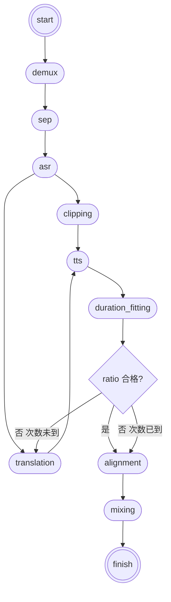

# magicdub-cli 系统设计

> 规范性事实来源。本地 CLI 译制引擎的架构、状态、路径与控制流；**永远不做唇形／口型修正**。  
> 代码仓库：`https://github.com/shishengkai/magicdub-cli`（与 `magicdub-skills` 分离）。  
> **实现与验收以本文第 2 节（v0.1.0）为准**；其后各节描述完整产品能力，超出 v0.1.0 范围的不在本版实现。

---

## 1. 定位

| 项 | 决定 |
| --- | --- |
| 形态 | 本地命令行：`magicdub`；仓库／包名仍为 `magicdub-cli`；用 `uv tool install` 安装，不放在配置目录下 |
| 与 skills | 配置／凭据均在 `~/.magicdub/cli/`（与 skills 分文件）；任务在 `…/MagicDub/cli/`，**不**打开 skills 的 `project.json`；本线不读 skills 凭据文件 |
| 架构 | **编排式 pipeline**：fixed step 与 slot（可挂 adapter）由 pipeline 调度；step 互不调用；adapter 不写状态、不碰正式路径 |
| 产出 | 配音成片 MP4、混音母版 WAV、SRT；人民币费用 ledger + 汇总 |
| 非目标 | 口型修正、下载上游（首版）、Web／Cloud |

---

## 2. v0.1.0 实现范围（开发与验收权威）

目标：每个 slot **一个** adapter，**一次全新任务**从 `start` 串行跑到 `finish`，产出成片／母版／SRT。先跑通实测；本版不做续跑与迭代预留行为。

### 2.1 做

| 项 | 约定 |
| --- | --- |
| CLI | `magicdub run …`；`magicdub update` 默认装 **最新正式 GitHub Release**（可用 `--ref`／`MAGICDUB_REF` 覆盖）；缺参直接报错，无交互 |
| 任务 | 每次 `run` **只新建并跑完一个任务目录**；不打开已有目录、不续跑、不跳过步骤 |
| pipeline | 串行；本进程内按 assets 键推进句级；失败即停 |
| fixed | demux、clipping、duration_fitting、alignment、mixing |
| slots | 单 adapter；`run.slots.*.order` 为单元素数组，实现取 `order[0]` |
| fitting | 合格／重译重 TTS（≤2）／forced 选最接近合格带 |
| 状态 | 全 schema 写入，未用填 null；`ledger` 逐请求追加 |
| 配置／凭据 | 安装／升级／每次启动确保 `~/.magicdub/cli/config.yaml` 与 `credentials`：缺文件写默认，已有则补齐缺失键（保留用户值；凭据不改写已有 Key）；文件优先，缺 key 再读环境变量 |
| 锁 | 任务根 `run.lock` 文件 + state 镜像；同机死 pid 清、活则拒；他机只报错 |

### 2.2 不做

续跑／断点；`--only`／`--from`／`--sentence`／`--force`／`lock clear`；slot fallback；`cancelled`；并行（concurrency 读入但不生效）；指纹跳过；下载上游；口型；第三方 adapter 热插。

### 2.3 Adapter

| slot | adapter_id | 目录 | 凭据 |
| --- | --- | --- | --- |
| sep | `fal/demucs` | `adapters/sep/fal_demucs/` | `FAL_KEY` |
| asr | `fal/whisper` | `adapters/asr/fal_whisper/` | `FAL_KEY` |
| translation | `deepseek/deepseek-flash` | `adapters/translation/deepseek_deepseek_flash/` | `DEEPSEEK_API_KEY` |
| tts | `fal/index-tts-2` | `adapters/tts/fal_index_tts_2/` | `FAL_KEY` |

目录名与 `adapter_id` 对应：`vendor/model` → `vendor_model`（`-` 改为 `_`）。例如日后 `openrouter/whisper` → `adapters/asr/openrouter_whisper/`。

### 2.4 已钉死约定

| 项 | 约定 |
| --- | --- |
| 配置缺键 | `constants.py` |
| `slots.<name>: []` | **报错** |
| translation 批 | 首译一次全句 `history=[]`；修正一次当前全部不合格句 + history |
| tts | 逐句串行 |
| 费用归属 | 凡 translation／TTS 的 API 费分别计入 `cost_of_translation`／`cost_of_tts`（含各轮返工）；`duration_fitting` 仅本地测时长／算 ratio／供 pipeline 标 selection，**无模型费用**；`cost_of_duration_fitting.*` 恒为 0（兼容字段，不再承接返工费） |
| 窗口 ≤ 0 或 ASR 空文本／0 句 | `input_invalid`，失败 |
| 对齐容差 | ≤ 1 ms |
| `speaker_id` | 文本 |
| 本版错误码 | 主要 `external_retryable`／`external_fatal`／`input_invalid`；同 adapter 最多共 3 次尝试 |

### 2.5 里程碑

| # | 内容 | 验收要点 |
| --- | --- | --- |
| M0 | 骨架 | `uv tool install .` → `magicdub --version`；目录树；ruff |
| M1 | 状态与路径 | state 原子写、file_ref、commit、任务目录、ULID、run.lock、配置语义 |
| M2 | start + demux | video／audio.wav／silent_video.mp4 |
| M3 | sep + asr | speech／non_speech；sentences；空句失败 |
| M4 | clipping + translation | src.wav；attempt 1 译文；ledger |
| M5 | tts + fitting | attempt≤3；三分支 |
| M6 | alignment + mixing + finish | final.{mp4,wav,srt}；`done` |
| M7 | 端到端 | 30–90 s 英文样片**一次新任务**；费用可加总；**不测续跑** |

M0 依赖：Python ≥ 3.12；`httpx`、`pyyaml`、`python-ulid`；系统 `ffmpeg`／`ffprobe`。

工作项细节与源码树见下文 §7–§8；实现时按里程碑推进即可，无需另读已归档 Draft。

---

## 3. 分层与硬规则

```text
CLI → pipeline → fixed:* | slot:* → adapter(s)
                 ↘ state.json + 任务目录
```

| 层 | 职责 |
| --- | --- |
| pipeline | 选下一步、分支／循环、更新编排态；不做 demux／API |
| fixed／slot | 读 input → 执行 → 校验 → **写 assets** → return；**禁止调用其他 step** |
| adapter | 收规范化输入；只写 `tmp/<step>/`；return 文件引用；**不写 state、不碰正式路径** |

硬规则：

1. step 互不调用；下一步只由 pipeline 决定。  
2. adapter 只 return；slot 负责 commit 正式路径并写 assets／ledger。  
3. 状态只存相对任务根的 path + sha256 + size_bytes 与标量；费用 CNY，精度 `0.00000001`。  
4. step 名：业务名原样（`demux`／`sep`／`asr`／`translation`／`tts`）；自拟用名词（`clipping`／`duration_fitting`／`alignment`／`mixing`）。

step 对 pipeline 的 return：`ok`、可选 `error_code`／`message`；slot 成功时带 `adapter_id`（入 ledger，不入句级 assets）。失败不得留下半套已提交字段。

---

## 4. 控制流

主链（v0.1.0 串行）：

```text
start → demux → sep → asr → clipping → translation → tts → duration_fitting
  →（按句分支）→ alignment →（全部句对齐后）→ mixing → finish
```

### 4.1 duration_fitting 之后（按句，pipeline 拥有）

合格带默认 `[0.8, 1.2]`（含边界），创建任务时冻结到 `run.fitting`。attempt 最大 = `1 + max_rewrites`（出厂 max_rewrites=2）。

| 条件 | 动作 |
| --- | --- |
| ratio 在合格带内 | `selection=fitting_pass`，`selected_attempt=当前` → alignment |
| 不合格且次数未到 | 当前 `rejected` → translation（新 attempt，仅不合格句 + history + 全文 transcript）→ tts → duration_fitting |
| 不合格且次数已到 | 在**全部** attempt 中选最接近合格带者 → `forced`；其余 `rejected` → alignment |

距离：`< lo` → `lo - ratio`；`> hi` → `ratio - hi`。同距取 `|ratio - 1|` 更小；再同取 **attempt 编号更小**。

### 4.2 句级与失败

- 句级进度只看 assets 键，不以 `steps.*.status=done` 为准跳过缺键句（完整产品续跑语义；v0.1.0 单次跑完，仍按此写状态）。  
- 0 句、空文本、任一句无法完成必需产物 → 任务 `failed`，不 mixing、不成片。v0.1.0 失败后须重新 `run` 开新目录。  
- `id` 按 `start_ms` 升序从 1；允许时间窗重叠；mixing／SRT 按 `start_ms`。

### 4.3 产物流程（示意）



---

## 5. 各 step 规格

路径前缀省略 `assets.`。文件节点 = path／sha256／size_bytes。

### 5.1 start

- 入：视频、`--src`／`--tgt`。缺参报错（v0.1.0）。  
- 出：新建任务目录与 state；`src.video.*`、`src.language`、`tgt.language`；`run.status=running`。不调度 demux。

### 5.2 fixed:demux

- 入：`src.video`  
- 出：`src.audio`（原采样率／声道 float32 WAV）、`src.silent_video`（`-an -c:v copy`）

### 5.3 slot:sep

- 入：`src.audio`  
- 出：`src.speech`、`src.non_speech`（多轨由 adapter 合成单一 non_speech）；`cost_of_sep`

### 5.4 slot:asr

- 入：`src.speech`（及语言等）  
- 出：`src.transcript`；每句 `id`／`start_ms`／`end_ms`／`speaker_id`／`src.text`  
- Whisper：adapter 内转 16 kHz 单声道；`diarize=true`；`speaker_id` 转文本  
- 0 句或空文本 → `input_invalid`

### 5.5 fixed:clipping

- 入：`src.speech` + 各句时间窗  
- 出：每句 `src.audio`、`src.audio_duration := end_ms - start_ms`（**非**文件探测）  
- 窗口 ≤ 0 → `input_invalid`

### 5.6 slot:translation

**同一 `translate` 入口**；不拆首译／修正。必带 `src.transcript`。句级负载：`id`、`src_text`、`target_duration_ms`、`attempt`、`history[]`（空=首译；非空=修正，含 text／tts_duration_ms／fitting_ratio）。返回 `[{id, text}]`。

费用：凡本 step 的 API 费一律计入 `cost_of_translation`（含各 attempt／返工轮）；不写入 `cost_of_duration_fitting`。

### 5.7 slot:tts

- 入：句 `src.audio`／`src.text`、当前 attempt 的 `text`  
- 出：`tgt[attempt].audio`  
- IndexTTS：有效非静音参考 < 0.5 s 时尾补静音至 0.6 s  
- 费用：凡本 step 的 API 费一律计入 `cost_of_tts`（含各 attempt／返工轮）；不写入 `cost_of_duration_fitting`

### 5.8 fixed:duration_fitting

- 入：当前 attempt `audio`、`src.audio_duration`  
- 出：`audio_duration`（探测）、`fitting_ratio`；**不写** selection／selected_attempt  
- **无外部 API、无模型费用**；本地测时长与算 ratio 后由 pipeline 标 selection。不合格句进入下一轮 **translation**（再 TTS），费用走 translation／tts 桶，不记入本 step

### 5.9 fixed:alignment

- 入：`selected_attempt` 对应 `audio`、`src.audio_duration`  
- 出：该条 `aligned_audio`；时长差 ≤ 1 ms（atempo，必要时分段）

### 5.10 fixed:mixing

- 入：各句采用稿的 `aligned_audio`／`text`、时间窗、`non_speech`、`silent_video`  
- 出：`tgt.final_video`／`final_audio`／`srt`  
- 母版 WAV：48 kHz float32；成片：AAC 320k、画面 copy；清描述性元数据（保留播放所需时间轴／旋转／色彩等）  
- SRT：采用稿译文；`,，.。` → 半角空格，合并空格；保留 ?! 与小数点；不烧录

### 5.11 finish

校验三文件与句数；`run.status=done`；打印路径与费用摘要。

---

## 6. 状态文件 `state.json`

### 6.1 顶层

`schema_version`（本设计为 1）、`engine: "magicdub-cli"`、`task_id`（ULID）、`title`（可改、不参与路径）、`created_at`／`updated_at`、`program{name,version}`、`run`、`assets`、`ledger[]`。

### 6.2 `run`

- `status`：`pending|running|done|failed|cancelled`（v0.1.0 不产生 cancelled）  
- `current_step`、`cursor`（句级加速，可空）  
- `fitting{lower_ratio,upper_ratio,max_rewrites}`：创建时冻结  
- `slots.{sep,asr,translation,tts}.order`：创建时冻结  
- `steps.<step>{status,started_at,finished_at,input_fingerprint,error_code,message}`  
- `lock`：与任务根 `run.lock` 镜像  
- `last_error`

句级完成键：asr → clipping → translation text → tts audio → fitting 两字段 → selected_attempt + selection → aligned_audio。

### 6.3 `assets`

文件引用一律相对任务根、`/` 分隔。

- `src`：language、video、audio、silent_video、speech、non_speech、transcript  
- `sentences[]`：id、start_ms、end_ms、speaker_id、selected_attempt；`src{text,audio,audio_duration}`；`tgt[]{attempt,text,audio,audio_duration,fitting_ratio,selection,aligned_audio}`  
- `tgt`：language、final_video、final_audio、srt  
- `cost`：sep／asr／translation／tts／duration_fitting.{translation,tts}（**恒 0，兼容保留**）／**total**（ledger 汇总；返工费计入 translation／tts，不进 duration_fitting）

`selection`：`fitting_pass|forced|rejected`；每句非 rejected 至多一条；只由 pipeline 写。实际 adapter 只记 ledger。

### 6.4 `ledger`

每次外部请求追加（含失败）：`id`、`at`、`step`、`sentence_id`、`attempt`、`adapter_id`、`ok`、`error_code`、`cost_cny`（未知保持 null）、`message`。fixed 无 API 费用可不入账。

写入顺序：tmp → 校验移正式路径 → assets → ledger／重算 cost → 更新 run → 失败不提交半套正式 path。

---

## 7. 目录、配置与源码树

### 7.1 用户配置

```text
~/.magicdub/
  cli/
    config.yaml        # 缺则写默认；已有则补齐缺失键（保留用户值）；运行时缺键仍用 constants
    credentials        # 缺则写默认；已有则追加缺失 KEY=（不改写已有值）；文件优先，缺 key 才用环境变量
  # skills 自用 credentials / credentials.env：本线不读
```

`config.yaml`（缺键用 constants；空 slots 列表报错）：

```yaml
projects_dir: null
fitting: { lower_ratio: 0.8, upper_ratio: 1.2, max_rewrites: 2 }
concurrency: { sep: 1, asr: 1, translation: 3, tts: 3 }  # v0.1.0 读入但不生效
slots:
  translation: [deepseek/deepseek-flash]
  # sep/asr/tts 缺省 → constants 出厂单元素列表
```

### 7.2 任务父目录

| 平台 | 默认 |
| --- | --- |
| macOS | `~/Movies/MagicDub/cli/` |
| Windows | `%USERPROFILE%\Videos\MagicDub\cli\` |
| Linux | `xdg-user-dir VIDEOS` 或 `~/Videos/MagicDub/cli/` |

任务名：`<安全 stem>_<YYYYMMDD_HHMMSS>/`；冲突加 `_`+4 位随机。权威身份为 `task_id`。

```text
<task_root>/
  state.json
  run.lock
  media/src/…
  media/sentences/<id>/src.wav
  media/sentences/<id>/tgt/attempt_<n>.wav
  media/sentences/<id>/tgt/attempt_<n>.aligned.wav
  exports/final.{mp4,wav,srt}
  tmp/<step>/…
```

### 7.3 源码树（包内）

```text
src/magicdub_cli/
  cli.py, constants.py, pipeline/
  steps/fixed/…  steps/slots/…
  adapters/base.py, registry.py
  adapters/{sep,asr,translation,tts}/<vendor_model>/
  state/, media/
```

---

## 8. 错误与锁

| 码 | 何时 | 下一步 |
| --- | --- | --- |
| `external_retryable` | 超时、连接、429／5xx | 同 adapter 有限重试，再 fallback（v0.1.0 无下一项则失败） |
| `external_fallback` | 402、额度、模型暂不可用 | 下一项（v0.1.0 → 失败） |
| `external_fatal` | 401、内容安全 | 任务失败 |
| `input_invalid` | 契约不符、0 句、空文本、校验失败 | 任务失败 |
| `adapter_exhausted` | order 用尽 | 任务失败 |

锁：任务根 `run.lock` JSON（`holder=hostname:pid`、`step`、`acquired_at`）；state 镜像；**检测以文件为准**。

从 skills 继承：IndexTTS 短参考补静音；SRT 标点与成片元数据清理见 §5.10。

---

## 9. 开发入口

1. 克隆／使用已有空仓 `magicdub-cli`。  
2. 按 §2.5 从 **M0** 起实现；行为冲突时以 **§2** 覆盖本文后续「完整能力」描述。  
3. API 端点与计费可从已验收的 `magicdub-skills` 移植，须适配本仓库 adapter 契约。  
4. 系统依赖：`ffmpeg`、`ffprobe`。

---

## 来源与证据

本文吸收并替代：

- `Drafts/magicdub-cli/2026-09-20_magicdub-cli流程图.md`
- `Drafts/magicdub-cli/2026-09-21_magicdub-cli状态文件assets字段设计.md`
- `Drafts/magicdub-cli/2026-09-22_magicdub-cli_pipeline设计.md`
- `Drafts/magicdub-cli/2026-09-22_magicdub-cli状态文件完整字段设计.md`
- `Drafts/magicdub-cli/2026-09-22_magicdub-cli目录与路径设计.md`
- `Drafts/magicdub-cli/2026-09-22_magicdub-cli_v0.1.0开发计划.md`

本文依据：

- `.records/events/2026-09/2026-09-22_055702_确认magicdub-cli翻译同一入口与history契约.md`
- `.records/events/2026-09/2026-09-22_055908_审查结论magicdub-cli设计足以开工v010.md`
- `.records/events/2026-09/2026-09-22_060500_确认v010不做续跑并钉死实现约定.md`
- `.records/events/2026-09/2026-09-23_035227_确认CLI命令名为magicdub.md`
- `.records/events/2026-09/2026-09-23_044613_确认cli配置凭据分目录与skills脱钩.md`
- `.records/events/2026-09/2026-09-23_052217_确认凭据文件优先于环境变量.md`
- `.records/events/2026-09/2026-09-23_055658_增加magicdub_update子命令.md`
- `.records/events/2026-09/2026-09-23_060238_公开magicdub-cli并跟随最新Release.md`
- `.records/events/2026-09/2026-09-23_070246_统一adapter目录为vendor_model.md`
- `.records/events/2026-09/2026-09-23_070640_安装时写入默认配置与凭据.md`
- `.records/events/2026-09/2026-09-23_070900_配置凭据改为补齐缺失键.md`
- `.records/events/2026-09/2026-09-23_080643_确认返工费用归translation与tts.md`

未单独发布开发文档：v0.1.0 范围与里程碑已并入本文第 2 节，足够开工。
